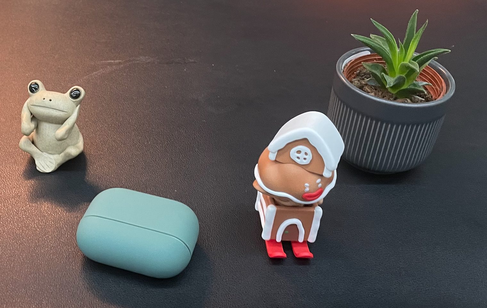
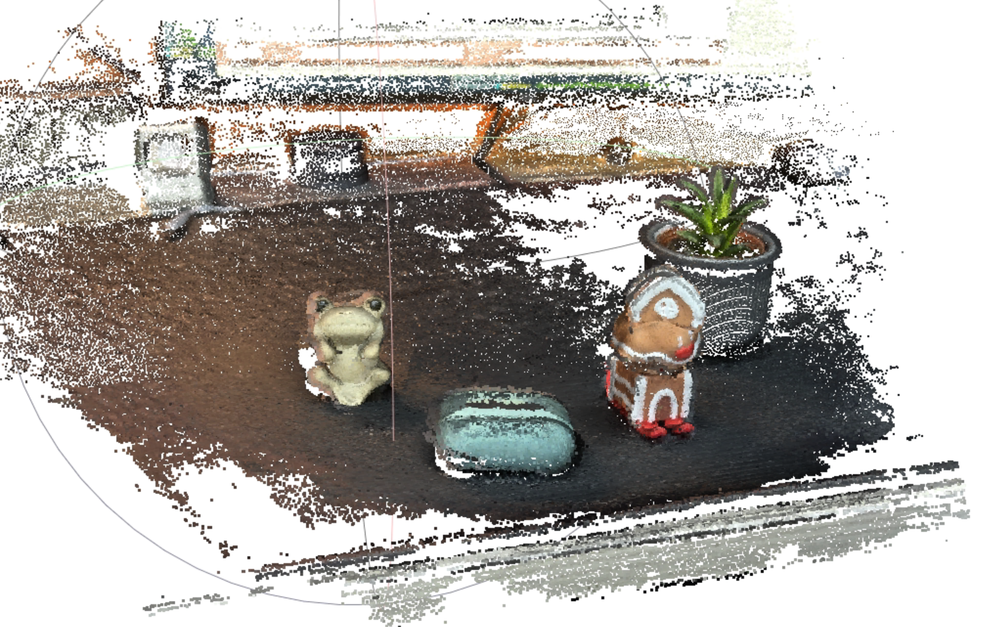
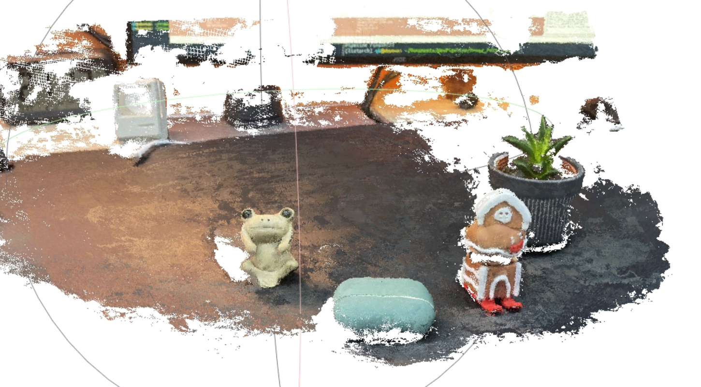
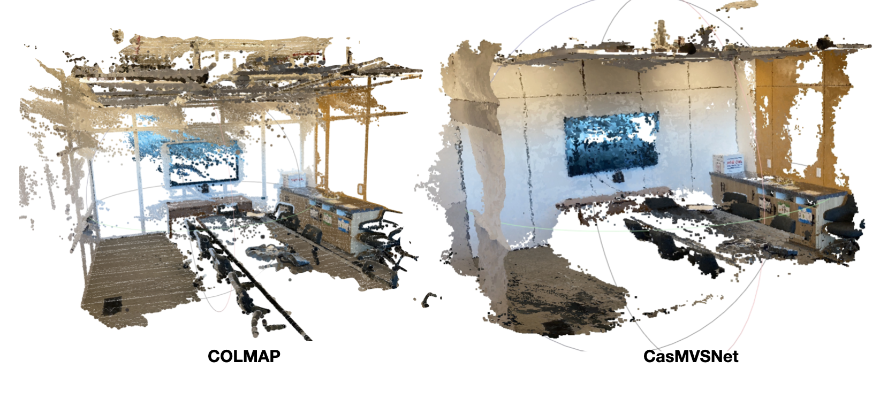

# Image-3D-Reconstrction

A complete pipeline for generating scene point clouds and meshes.

Before starting, I assume that you have completed the [installation of colmap](https://colmap.github.io/install.html) and the configuration of the required python environment for [cascade-stereo](https://github.com/alibaba/cascade-stereo)/[casmvsnet_pl](https://github.com/kwea123/CasMVSNet_pl)/[ConvONet](https://github.com/autonomousvision/convolutional_occupancy_networks).

## 1.Register Image Pose[[COLMAP](https://github.com/colmap/colmap)]

Use My Desk data for example.



### **Sparse Reconstruction**

Use imgs2poses.py(from [llff](https://github.com/Fyusion/LLFF)) to call COLMAP to run structure from motion to get 6DoF image poses and near/far depth bounds for the scene.

```shell
python imgs2poses.py --scenedir xxx/xxx/xxx 
```

Result will be saved in *scenedir*, and sparse model will be saved in *scenedir/sparse/0*

### **Dense Reconstruction**

```shell
python sparse2dense.py --scenedir xxx/xxx/xxx
```

In this example, 6.6mins for stereo patch and 0.02mins for stereo fusion.

The results show that in low temperature textured regions, traditional depth restoration methods cannot achieve satisfactory results:



### **CasMVSNet input from COLMAP SfM**

In order to use CasMVSNet, the data needs to be transformed by(from [casmvsnet/CasMVSNet)](https://github.com/alibaba/cascade-stereo/tree/master/CasMVSNet)) :

```shell
python colmap2mvsnet.py --dense_folder xxx/dense --save_folder xxx/casmvsnet
```

Note: Before converting the colmap results, you need make sure that images are undistorted by COLMAP and saved in *xxx/dense* folder. 

## 2.Generate Depth Image and Fusion[CasMVSNet]

### **[CasMVSNet-Stereo](https://github.com/alibaba/cascade-stereo)**

Use CasMVSNet to generate depth map, [pretrained model download](https://virutalbuy-public.oss-cn-hangzhou.aliyuncs.com/share/cascade-stereo/CasMVSNet/48_32_8-4-2-1_dlossw-0.5-1.0-2.0/casmvsnet.ckpt) here.

```shell
python test.py --dataset=general_eval --batch_size=1 --testpath_single_scene=xxx/casmvsnet --loadckpt=xxx/casmvsnet.ckpt --testlist=all --outdir=xxx/mvs --interval_scale=1.06
```

Only use 2mins to get fusion pointcloud.



### **[CasMVSNet_pl](https://github.com/kwea123/CasMVSNet_pl)**

Also, you can use CasMVSNet_pl to get depth and fusion.[TODO]

## 3.Generate Mesh[ConvONet]

[TODO]


## 4.Easy Use

Just run the scripts to do all things!

```shell
# CasMVSNet depth pre
bash scripts/run_genpoints_casmvsnet.sh
# COLMAP depth pre
bash scripts/run_genpoints_colmap.sh
```


## 5.More Results



# 6.Acknowledgements

Thanks excellent work [COLMAP](https://github.com/colmap/colmap).Thanks to [Xiaodong Gu](https://github.com/gxd1994) for his excellent work [Cascade-Stereo](https://github.com/alibaba/cascade-stereo).Thanks to [kwea123](https://github.com/kwea123) for his excellent work [CasMVSNet_pl](https://github.com/kwea123/CasMVSNet_pl).Thanks to [Songyou Peng](https://github.com/pengsongyou) for his excellent work [Convolutional Occupancy Networks](https://github.com/autonomousvision/convolutional_occupancy_networks).Finally, thanks to [Yao Yao](https://github.com/YoYo000) for his excellent work [MVSNet](https://github.com/YoYo000/MVSNet) for its contribution to deep learning deep reconstruction.
